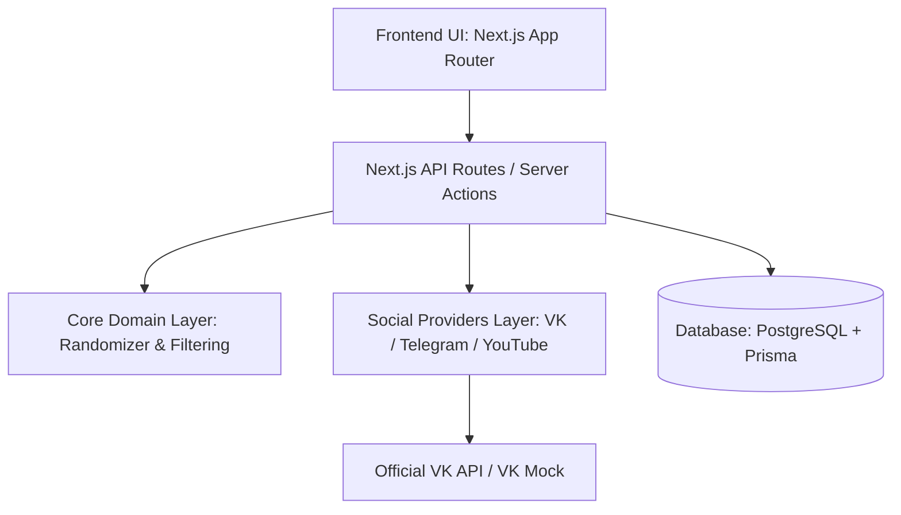

# Архитектура VK Giveaway Randomizer

## 1. Обзор архитектуры

Система построена по принципам чистой архитектуры (Clean Architecture / Hexagonal Architecture) с разделением на независимые слои:

## 2. Слои приложения

### 2.1. Core Domain Layer (`src/core/`)
Ядро приложения не зависит от конкретной социальной сети или веб-фреймворка:
- **`src/core/randomizer/`**:
  - `deterministic.ts`: Реализация детерминированного генератора случайных чисел (PRNG) и перетасовки Фишера-Йетса с использованием криптографических хешей (SHA-256 HMAC).
  - `hasher.ts`: Генерация фиксированного отпечатка (Snapshot Hash) списка участников перед розыгрышем.
- **`src/core/filtering/`**:
  - `filter-engine.ts`: Механизм фильтрации участников на основе заданных условий (лайк, репост, коммент, подписка, черный список ID, исключение админов, дедупликация).
- **`src/core/types/`**:
  - Типизированные контракты сущностей (`Giveaway`, `Participant`, `DrawResult`, `AuditRecord`, `FilterRules`).

### 2.2. Social Providers Layer (`src/providers/`)
Абстракция взаимодействия с внешними платформами:
- **`SocialMediaProvider`** (Interface):
  - `fetchPost(url: string)`: Получение метаданных публикации (автор, текст, превью, счетчики).
  - `fetchParticipants(params: FetchParticipantsParams)`: Загрузка списка участников (лайки, комменты, репосты).
  - `checkSubscription(userIds: string[], groupId: string)`: Проверка подписки на сообщество.
- **`VkProvider`**: Боевой клиент к VK API с поддержкой пакетных запросов `execute`.
- **`VkMockProvider`**: Тестовый провайдер для демонстрации, локальной разработки и оффлайн-тестирования.
- **`ProviderFactory`**: Фабрика для получения провайдера по типу платформы (`VK`, `TELEGRAM`, `YOUTUBE`).

### 2.3. Data & Persistence Layer (`prisma/` + `src/lib/`)
- **PostgreSQL** в качестве надежного реляционного хранилища.
- **Prisma ORM** для типобезопасной работы с БД.
- Хранение всех розыгрышей, снапшотов участников и записей аудита для публичной верификации.

### 2.4. Presentation Layer (`src/app/` + `src/components/`)
- Modern React + Next.js App Router.
- Интерактивный визард создания розыгрыша с живым превью поста, настройкой условий, интерактивной таблицей участников и презентацией победителей.

---

## 3. Механизм честности и доказуемости (Provably Fair)

Каждый розыгрыш формирует криптографический аудит-след на базе алгоритма `HMAC_SHA256_FY_V1`:

1. **Снапшот участников**: Список прошедших фильтрацию (eligible) участников сортируется по `platformUserId` и канонически сериализуется:
   $$\text{ParticipantsSnapshotHash} = \text{SHA256}(\text{canonicalStringify}(\text{sortedEligibleParticipants}))$$
2. **Seed Pre-Commitment (Защита от Seed Grinding)**:
   - В момент фиксации слепка (`SNAPSHOT_LOCKED`) сервер генерирует CSPRNG seed и публикует его SHA-256 обязательство:
     $$\text{SeedCommitment} = \text{SHA256}(\text{seed})$$
   - До момента проведения жеребьевки сам `seed` строго скрыт (`seed: null`), но `seedCommitment` доступен публично. Организатор может зафиксировать его публично (например, в комментарии к конкурсному посту VK) до розыгрыша.
3. **Детерминированный выбор (`HMAC_SHA256_FY_V1`)**:
   - Выборка осуществляется с помощью несмещенного сэмплинга Фишера-Йетса (Fisher-Yates) поверх потока псевдослучайных байт HMAC-SHA256:
     $$\text{ByteStream} = \text{HMAC-SHA256}(\text{key} = \text{seed}, \text{data} = \text{ParticipantsSnapshotHash} \parallel \text{ConditionsHash} \parallel \text{blockIndex})$$
   - Позиции победителей и резерва рассчитываются детерминированно.
4. **Публичное раскрытие и аудит**:
   - После перевода розыгрыша в статус `DRAWN` сервер раскрывает `seed`.
   - Любой участник может проверить:
     1. $\text{SHA256}(\text{seed}) == \text{SeedCommitment}$ (гарантия того, что seed не подбирался под желаемого победителя);
     2. Воспроизведение результатов выборки при наличии слепка;
     3. Неизменность `deterministicProofHash` и `auditEventHash`.

### 3.1. Границы публичной проверяемости и защита приватности (PII Compromise)

- **Что проверяется внешним наблюдателем:**
  - Корректность раскрытия seed относительно опубликованного pre-commitment.
  - Математическая повторяемость алгоритма.
  - Совпадение хешей доказательства (`deterministicProofHash`).
- **Что остаётся приватным:**
  - Полный список участников и их персональные данные (PII) **не отдаются анонимным пользователям** в целях соблюдения требований защиты данных третьих лиц. Публикуются только победители и хеш слепка `participantsSnapshotHash`.
  - Внешний наблюдатель без исходного списка участников не может самостоятельно с нуля пересчитать `participantsSnapshotHash`.
- **Архитектурный статус доверия:**
  - Доказательство формируется и проверяется на сервере Randomayzer на основе зафиксированного в БД слепка. Децентрализованный внешний якорь (блокчейн, drand, RFC 3161) на текущем этапе не используется.

