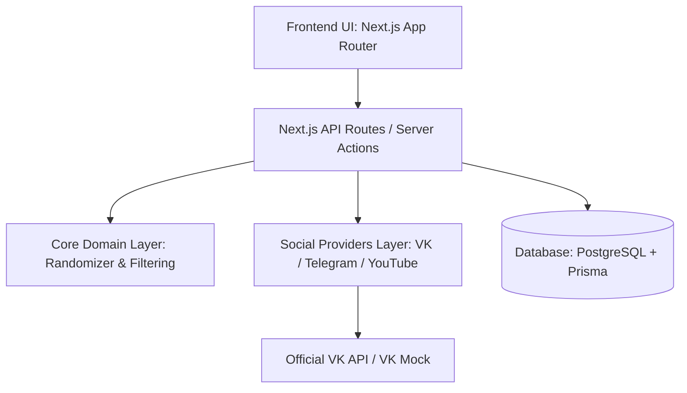

# Архитектура VK Giveaway Randomizer

## 1. Обзор архитектуры

Система построена по принципам чистой архитектуры (Clean Architecture / Hexagonal Architecture) с разделением на независимые слои:

## 2. Слои приложения

### 2.1. Core Domain Layer (`src/core/`)
Ядро приложения не зависит от конкретной социальной сети или веб-фреймворка:
- **`src/core/randomizer/`**:
  - `deterministic.ts`: Реализация детерминированного генератора случайных чисел (PRNG) и перетасовки Фишера-Йетса с использованием криптографических хешей (SHA-256 HMAC).
  - `hasher.ts`: Генерация фиксированного отпечатка (Snapshot Hash) списка участников перед розыгрышем.
- **`src/core/filtering/`**:
  - `filter-engine.ts`: Механизм фильтрации участников на основе заданных условий (лайк, репост, коммент, подписка, черный список ID, исключение админов, дедупликация).
- **`src/core/types/`**:
  - Типизированные контракты сущностей (`Giveaway`, `Participant`, `DrawResult`, `AuditRecord`, `FilterRules`).

### 2.2. Social Providers Layer (`src/providers/`)
Абстракция взаимодействия с внешними платформами:
- **`SocialMediaProvider`** (Interface):
  - `fetchPost(url: string)`: Получение метаданных публикации (автор, текст, превью, счетчики).
  - `fetchParticipants(params: FetchParticipantsParams)`: Загрузка списка участников (лайки, комменты, репосты).
  - `checkSubscription(userIds: string[], groupId: string)`: Проверка подписки на сообщество.
- **`VkProvider`**: Боевой клиент к VK API с поддержкой пакетных запросов `execute`.
- **`VkMockProvider`**: Тестовый провайдер для демонстрации, локальной разработки и оффлайн-тестирования.
- **`ProviderRegistry`**: Фабрика для получения провайдера по типу платформы (`vk`, `telegram`, `youtube`).

### 2.3. Data & Persistence Layer (`prisma/` + `src/lib/`)
- **PostgreSQL** в качестве надежного реляционного хранилища.
- **Prisma ORM** для типобезопасной работы с БД.
- Хранение всех розыгрышей, снапшотов участников и записей аудита для публичной верификации.

### 2.4. Presentation Layer (`src/app/` + `src/components/`)
- Modern React + Next.js App Router.
- Интерактивный визард создания розыгрыша с живым превью поста, настройкой условий, интерактивной таблицей участников и презентацией победителей.

---

## 3. Механизм честности и доказуемости (Provably Fair)

Каждый розыгрыш формирует криптографический аудит-след:
1. **Снапшот участников**: Список прошедших фильтрацию (eligible) участников сортируется по `platformUserId` и хешируется через SHA-256:
   $$\text{ParticipantsHash} = \text{SHA256}(\text{JSON}(\text{sortedEligibleParticipants}))$$
2. **Seed розыгрыша**: Пользовательский или сгенерированный криптографически стойкий seed.
3. **Детерминированный выбор**:
   - Для каждого шага выбора индекса вычисляется:
     $$\text{Hash}_i = \text{HMAC-SHA256}(\text{seed} + ":" + i, \text{ParticipantsHash})$$
   - Индекс победителя определяется детерминированно из полученного хеша.
4. **Результат**: Зная `ParticipantsHash` и `seed`, любой внешний наблюдатель может воспроизвести выбор и убедиться в честности результата на 100%.
