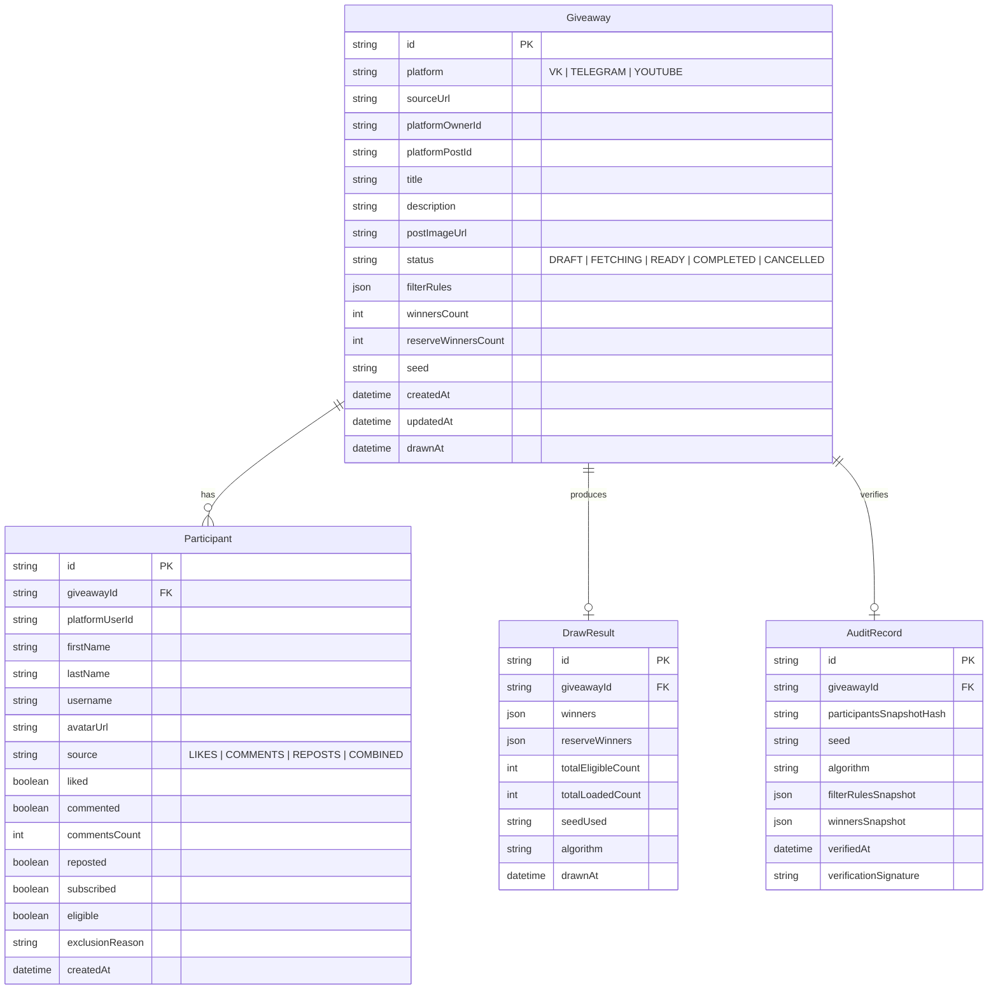

# Модель данных VK Giveaway Randomizer

## 1. Схема данных (Entity-Relationship)

## 2. Описание сущностей

### Giveaway (Розыгрыш)
- Главная сущность кампании розыгрыша.
- Хранит метаданные поста (ссылка, ID автора, ID поста, заголовок, превью-картинка), статус выполнения, настройки фильтрации и параметры выбора (кол-во победителей, seed).

### Participant (Участник)
- Запись об участнике, полученном из социальной сети.
- Хранит профиль пользователя (`platformUserId`, имя, аватарка) и флаги выполненных действий (`liked`, `commented`, `commentsCount`, `reposted`, `subscribed`).
- Поле `eligible: boolean` определяет, допущен ли участник к жеребьевке.
- Поле `exclusionReason: string` фиксирует точную причину недопуска (например, `"NOT_SUBSCRIBED"`, `"NO_REPOST"`, `"BLACKLISTED"`).

### DrawResult (Результат розыгрыша)
- Зафиксированный результат проведения розыгрыша.
- Хранит массив основных победителей, массив резервных победителей, время розыгрыша, алгоритм и использованный seed.

### AuditRecord (Запись аудита и доказуемости)
- Неизменяемый криптографический слепок розыгрыша.
- Содержит `participantsSnapshotHash` (SHA-256 хеш канонического списка участников), точный `seed`, снапшот правил фильтрации и результатов. Позволяет любому стороннему лицу проверить результат жеребьевки.
