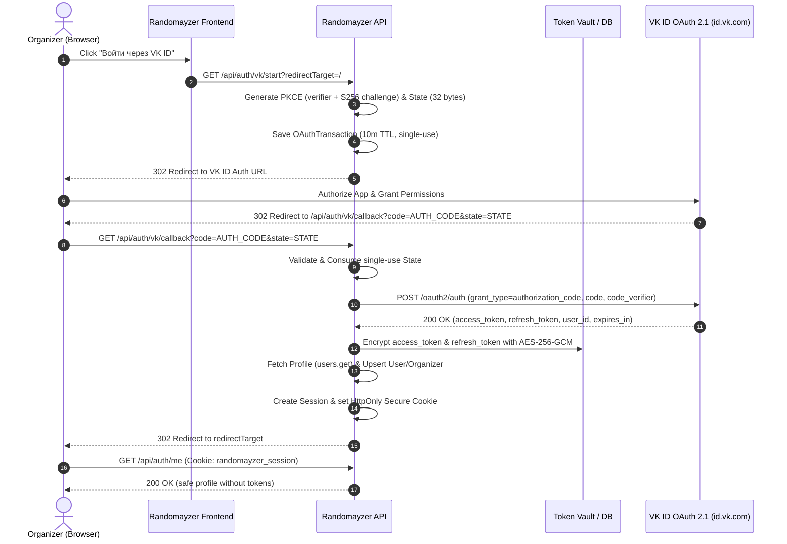

# VK ID OAuth 2.1 Authentication Flow

This document specifies the authorization flow, endpoints, and security contracts for organizer login via VK ID.

---

## Sequence Diagram

---

## Official Endpoints

1. **Authorization Start**: `https://id.vk.com/auth`
   - Parameters:
     - `response_type=code`
     - `client_id` (VK App ID)
     - `redirect_uri` (`https://randomayzer.domain/api/auth/vk/callback`)
     - `state` (Cryptographically random, single-use, 10 min TTL)
     - `code_challenge` (BASE64URL(SHA256(code_verifier)))
     - `code_challenge_method=S256`
     - `scope=wall,groups,offline`

2. **Token Exchange**: `https://id.vk.com/oauth2/auth`
   - Method: POST `application/x-www-form-urlencoded`
   - Parameters:
     - `grant_type=authorization_code`
     - `code`
     - `code_verifier`
     - `client_id`
     - `client_secret`
     - `redirect_uri`
     - `state`
